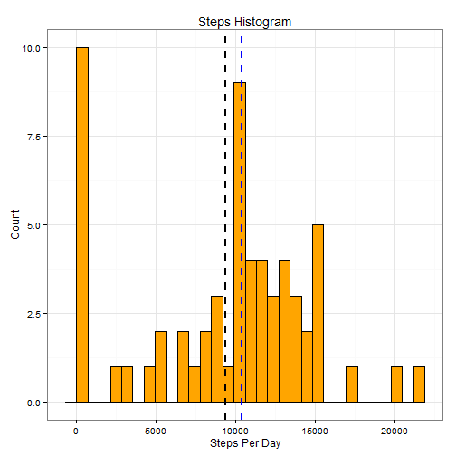
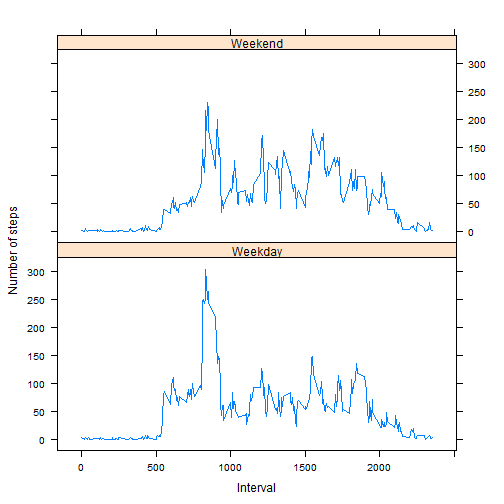

```r
library(lubridate)
library(dplyr)
library(tidyr)
library(ggplot2)
library(reshape2)
library(lattice)
library(ggvis)
library(googleVis)
```
####################################################
#Loading and preprocessing the data
##Load the data (i.e. read.csv())

```r
getfile <- tempfile()
download.file ("https://d396qusza40orc.cloudfront.net/repdata%2Fdata%2Factivity.zip" , getfile)
ac = read.csv(unz(getfile, "activity.csv"))
unlink(getfile)
```

##Process/transform the data (if necessary) into a format suitable for your analysis

```r
str(ac) ; head(ac)
```

```
## 'data.frame':	17568 obs. of  3 variables:
##  $ steps   : int  NA NA NA NA NA NA NA NA NA NA ...
##  $ date    : Factor w/ 61 levels "2012-10-01","2012-10-02",..: 1 1 1 1 1 1 1 1 1 1 ...
##  $ interval: int  0 5 10 15 20 25 30 35 40 45 ...
```

```
##   steps       date interval
## 1    NA 2012-10-01        0
## 2    NA 2012-10-01        5
## 3    NA 2012-10-01       10
## 4    NA 2012-10-01       15
## 5    NA 2012-10-01       20
## 6    NA 2012-10-01       25
```

```r
ac$Date = as.Date(ac$date)
ac$date = NULL
```
Changing date to actual date as was implied in the assignment
I could transfrom the interval as a massive factor variable but decided to leave as is for this analysis. Steps are numberic so they are fine.

##What is mean total number of steps taken per day?

```r
ac_days = ac %>% group_by(Date) %>% 
 summarize( D_steps = sum(steps, na.rm=T))

mean(ac_days$D_steps)
```

```
## [1] 9354.23
```
I take the total steps for each day and then take the overall mean of the summed steps.

##Make a histogram of the total number of steps taken each day

```r
ggplot(ac_days, aes(x=D_steps)) + geom_histogram(bindwidth=1 , colour="black", fill="orange" ,  position="identity") +
 geom_vline(aes(xintercept=mean(D_steps, na.rm=T)),  color="black", linetype="dashed", size=1) +
 geom_vline(aes(xintercept=median(D_steps, na.rm=T)),  color="blue", linetype="dashed", size=1) +
  xlab("Steps Per Day") + ylab("Count") + ggtitle("Steps Histogram") +
  theme_bw()
```

```
## stat_bin: binwidth defaulted to range/30. Use 'binwidth = x' to adjust this.
```

 

##Calculate and report the mean and median total number of steps taken per day

The median and mean are colored in the above histogram as well.
The mean is colored in black and the median is colored in blue
Here they are in actual hard numbers

```r
mean(ac_days$D_steps)
```

```
## [1] 9354.23
```

```r
median(ac_days$D_steps)
```

```
## [1] 10395
```
It appears that the median is slightly higer than mean implying that the data is skewed, as the histogram confrims.

#What is the average daily activity pattern?

##Make a time series plot (i.e. type = "l") of the 5-minute interval (x-axis) and the average number of steps taken, averaged across all days (y-axis)

```r
time = ac %>% select(interval, steps ) %>% group_by (interval) %>%
  summarize( Avg_Steps = mean(steps , na.rm=T)) %>%
  arrange(desc(interval)) 

time_p = gvisLineChart(time , xvar="interval", yvar="Avg_Steps",
 options=list(title="          Plotted Intervals by Daily Average", legend="left",
                titleTextStyle="{color:'black', fontSize:18}",                         
                vAxis="{gridlines:{color:'black', count:3}}",
                hAxis="{title:'Avg Steps', titleTextStyle:{color:'black'}}"
                ,series="[{color:'blue', targetAxisIndex: 0}, 
                         {color: 'black',targetAxisIndex:1}]",
                vAxes="[{title:'Interval'}, 
                                  {title:'Value 2 (\U00A3)'}]"                       
                ))

print(time_p, "chart")
```

<!-- LineChart generated in R 3.1.2 by googleVis 0.5.6 package -->
<!-- Sat Dec 13 23:34:09 2014 -->


<!-- jsHeader -->
<script type="text/javascript">
 
// jsData 
function gvisDataLineChartID127c3dbb447c () {
var data = new google.visualization.DataTable();
var datajson =
[
 [
 2355,
1.075471698 
],
[
 2350,
0.2264150943 
],
[
 2345,
0.641509434 
],
[
 2340,
3.301886792 
],
[
 2335,
4.698113208 
],
[
 2330,
2.603773585 
],
[
 2325,
1.58490566 
],
[
 2320,
0.9622641509 
],
[
 2315,
0.8301886792 
],
[
 2310,
0 
],
[
 2305,
2.849056604 
],
[
 2300,
3.301886792 
],
[
 2255,
4.603773585 
],
[
 2250,
1.603773585 
],
[
 2245,
0.1132075472 
],
[
 2240,
0.320754717 
],
[
 2235,
2.20754717 
],
[
 2230,
9.754716981 
],
[
 2225,
8.698113208 
],
[
 2220,
7.075471698 
],
[
 2215,
8.509433962 
],
[
 2210,
4.811320755 
],
[
 2205,
3.679245283 
],
[
 2200,
1.452830189 
],
[
 2155,
2.622641509 
],
[
 2150,
8.132075472 
],
[
 2145,
7.79245283 
],
[
 2140,
8.679245283 
],
[
 2135,
16.30188679 
],
[
 2130,
14.66037736 
],
[
 2125,
8.018867925 
],
[
 2120,
12.45283019 
],
[
 2115,
19.24528302 
],
[
 2110,
23.45283019 
],
[
 2105,
17.22641509 
],
[
 2100,
15.94339623 
],
[
 2055,
20.1509434 
],
[
 2050,
32.30188679 
],
[
 2045,
21.32075472 
],
[
 2040,
19.54716981 
],
[
 2035,
21.33962264 
],
[
 2030,
27.30188679 
],
[
 2025,
21.16981132 
],
[
 2020,
26.81132075 
],
[
 2015,
33.33962264 
],
[
 2010,
19.33962264 
],
[
 2005,
19.01886792 
],
[
 2000,
19.62264151 
],
[
 1955,
33.52830189 
],
[
 1950,
45.66037736 
],
[
 1945,
25.54716981 
],
[
 1940,
30.20754717 
],
[
 1935,
40.01886792 
],
[
 1930,
27.39622642 
],
[
 1925,
20.71698113 
],
[
 1920,
36.32075472 
],
[
 1915,
53.35849057 
],
[
 1910,
58.03773585 
],
[
 1905,
77.83018868 
],
[
 1900,
84.86792453 
],
[
 1855,
85.60377358 
],
[
 1850,
86.58490566 
],
[
 1845,
99.45283019 
],
[
 1840,
85.33962264 
],
[
 1835,
74.24528302 
],
[
 1830,
77.69811321 
],
[
 1825,
67.77358491 
],
[
 1820,
59.26415094 
],
[
 1815,
85.32075472 
],
[
 1810,
74.69811321 
],
[
 1805,
58.01886792 
],
[
 1800,
40.67924528 
],
[
 1755,
37.45283019 
],
[
 1750,
34.77358491 
],
[
 1745,
56.50943396 
],
[
 1740,
75.09433962 
],
[
 1735,
59.66037736 
],
[
 1730,
68.94339623 
],
[
 1725,
78.94339623 
],
[
 1720,
72.71698113 
],
[
 1715,
61.22641509 
],
[
 1710,
50.71698113 
],
[
 1705,
56.30188679 
],
[
 1700,
46.62264151 
],
[
 1655,
43.67924528 
],
[
 1650,
46.20754717 
],
[
 1645,
45.45283019 
],
[
 1640,
44.66037736 
],
[
 1635,
38.56603774 
],
[
 1630,
43.86792453 
],
[
 1625,
59.77358491 
],
[
 1620,
56.90566038 
],
[
 1615,
63.16981132 
],
[
 1610,
74.54716981 
],
[
 1605,
64.13207547 
],
[
 1600,
62.13207547 
],
[
 1555,
83.96226415 
],
[
 1550,
102.1132075 
],
[
 1545,
98.66037736 
],
[
 1540,
82.90566038 
],
[
 1535,
65.32075472 
],
[
 1530,
48.13207547 
],
[
 1525,
47.75471698 
],
[
 1520,
45.96226415 
],
[
 1515,
38.8490566 
],
[
 1510,
35.49056604 
],
[
 1505,
36.0754717 
],
[
 1500,
30.01886792 
],
[
 1455,
43.77358491 
],
[
 1450,
43.62264151 
],
[
 1445,
26.0754717 
],
[
 1440,
17.11320755 
],
[
 1435,
27.50943396 
],
[
 1430,
41.8490566 
],
[
 1425,
37.54716981 
],
[
 1420,
35.47169811 
],
[
 1415,
48.69811321 
],
[
 1410,
43.58490566 
],
[
 1405,
51.96226415 
],
[
 1400,
55.75471698 
],
[
 1355,
60.81132075 
],
[
 1350,
47.32075472 
],
[
 1345,
53.54716981 
],
[
 1340,
39.96226415 
],
[
 1335,
25.13207547 
],
[
 1330,
42.75471698 
],
[
 1325,
56.43396226 
],
[
 1320,
46.24528302 
],
[
 1315,
40.98113208 
],
[
 1310,
43.26415094 
],
[
 1305,
39.88679245 
],
[
 1300,
42.33962264 
],
[
 1255,
67.28301887 
],
[
 1250,
45.05660377 
],
[
 1245,
37.73584906 
],
[
 1240,
26.52830189 
],
[
 1235,
32.41509434 
],
[
 1230,
54.47169811 
],
[
 1225,
50.16981132 
],
[
 1220,
63.39622642 
],
[
 1215,
92.77358491 
],
[
 1210,
94.8490566 
],
[
 1205,
87.69811321 
],
[
 1200,
63.86792453 
],
[
 1155,
59.18867925 
],
[
 1150,
46.03773585 
],
[
 1145,
44.60377358 
],
[
 1140,
42.03773585 
],
[
 1135,
49.98113208 
],
[
 1130,
33.43396226 
],
[
 1125,
26.47169811 
],
[
 1120,
28.37735849 
],
[
 1115,
25.54716981 
],
[
 1110,
21.32075472 
],
[
 1105,
29.67924528 
],
[
 1100,
31.35849057 
],
[
 1055,
31.94339623 
],
[
 1050,
25.09433962 
],
[
 1045,
28.33962264 
],
[
 1040,
34.69811321 
],
[
 1035,
37.41509434 
],
[
 1030,
44.28301887 
],
[
 1025,
50.79245283 
],
[
 1020,
38.9245283 
],
[
 1015,
52.66037736 
],
[
 1010,
42.41509434 
],
[
 1005,
26.98113208 
],
[
 1000,
40.56603774 
],
[
 955,
21.05660377 
],
[
 950,
34.98113208 
],
[
 945,
38.75471698 
],
[
 940,
24.79245283 
],
[
 935,
45.22641509 
],
[
 930,
66.20754717 
],
[
 925,
95.96226415 
],
[
 920,
103.7169811 
],
[
 915,
108.1132075 
],
[
 910,
109.1132075 
],
[
 905,
124.0377358 
],
[
 900,
143.4528302 
],
[
 855,
167.0188679 
],
[
 850,
183.3962264 
],
[
 845,
179.5660377 
],
[
 840,
195.9245283 
],
[
 835,
206.1698113 
],
[
 830,
177.3018868 
],
[
 825,
155.3962264 
],
[
 820,
171.1509434 
],
[
 815,
157.5283019 
],
[
 810,
129.4339623 
],
[
 805,
68.20754717 
],
[
 800,
73.37735849 
],
[
 755,
56.1509434 
],
[
 750,
57.8490566 
],
[
 745,
69.54716981 
],
[
 740,
52.26415094 
],
[
 735,
44.32075472 
],
[
 730,
55.67924528 
],
[
 725,
50.98113208 
],
[
 720,
49.9245283 
],
[
 715,
54.50943396 
],
[
 710,
50.50943396 
],
[
 705,
44.37735849 
],
[
 700,
43.81132075 
],
[
 655,
49.03773585 
],
[
 650,
37.35849057 
],
[
 645,
44.16981132 
],
[
 640,
44.01886792 
],
[
 635,
39.33962264 
],
[
 630,
52.1509434 
],
[
 625,
47.0754717 
],
[
 620,
49.96226415 
],
[
 615,
63.45283019 
],
[
 610,
53.77358491 
],
[
 605,
49.26415094 
],
[
 600,
31.49056604 
],
[
 555,
44.49056604 
],
[
 550,
39.45283019 
],
[
 545,
18.33962264 
],
[
 540,
16.01886792 
],
[
 535,
6.056603774 
],
[
 530,
2.094339623 
],
[
 525,
2.962264151 
],
[
 520,
3.320754717 
],
[
 515,
2.245283019 
],
[
 510,
3 
],
[
 505,
1.566037736 
],
[
 500,
0 
],
[
 455,
1.113207547 
],
[
 450,
3.113207547 
],
[
 445,
0.8301886792 
],
[
 440,
3.490566038 
],
[
 435,
0.6603773585 
],
[
 430,
4.113207547 
],
[
 425,
0.358490566 
],
[
 420,
0.3396226415 
],
[
 415,
0 
],
[
 410,
2.566037736 
],
[
 405,
0.9433962264 
],
[
 400,
1.188679245 
],
[
 355,
0 
],
[
 350,
0 
],
[
 345,
0.07547169811 
],
[
 340,
0.4905660377 
],
[
 335,
0.5849056604 
],
[
 330,
1.622641509 
],
[
 325,
0.6226415094 
],
[
 320,
0.2075471698 
],
[
 315,
0 
],
[
 310,
0 
],
[
 305,
0 
],
[
 300,
0 
],
[
 255,
0.9433962264 
],
[
 250,
1.547169811 
],
[
 245,
0 
],
[
 240,
0 
],
[
 235,
0.2264150943 
],
[
 230,
0 
],
[
 225,
0.1320754717 
],
[
 220,
0 
],
[
 215,
0 
],
[
 210,
1.132075472 
],
[
 205,
0 
],
[
 200,
0 
],
[
 155,
0 
],
[
 150,
0.2641509434 
],
[
 145,
0.3773584906 
],
[
 140,
0.1698113208 
],
[
 135,
0.1698113208 
],
[
 130,
1.830188679 
],
[
 125,
1.113207547 
],
[
 120,
0 
],
[
 115,
0.3396226415 
],
[
 110,
0.1509433962 
],
[
 105,
0.679245283 
],
[
 100,
0.320754717 
],
[
 55,
0.1320754717 
],
[
 50,
0.3018867925 
],
[
 45,
1.471698113 
],
[
 40,
0 
],
[
 35,
0.8679245283 
],
[
 30,
0.5283018868 
],
[
 25,
2.094339623 
],
[
 20,
0.07547169811 
],
[
 15,
0.1509433962 
],
[
 10,
0.1320754717 
],
[
 5,
0.3396226415 
],
[
 0,
1.716981132 
] 
];
data.addColumn('number','interval');
data.addColumn('number','Avg_Steps');
data.addRows(datajson);
return(data);
}
 
// jsDrawChart
function drawChartLineChartID127c3dbb447c() {
var data = gvisDataLineChartID127c3dbb447c();
var options = {};
options["allowHtml"] = true;
options["title"] = "          Plotted Intervals by Daily Average";
options["legend"] = "left";
options["titleTextStyle"] = {color:'black', fontSize:18};
options["vAxis"] = {gridlines:{color:'black', count:3}};
options["hAxis"] = {title:'Avg Steps', titleTextStyle:{color:'black'}};
options["series"] = [{color:'blue', targetAxisIndex: 0}, 
                         {color: 'black',targetAxisIndex:1}];
options["vAxes"] = [{title:'Interval'}, 
                                  {title:'Value 2 (£)'}];

    var chart = new google.visualization.LineChart(
    document.getElementById('LineChartID127c3dbb447c')
    );
    chart.draw(data,options);
    

}
  
 
// jsDisplayChart
(function() {
var pkgs = window.__gvisPackages = window.__gvisPackages || [];
var callbacks = window.__gvisCallbacks = window.__gvisCallbacks || [];
var chartid = "corechart";
  
// Manually see if chartid is in pkgs (not all browsers support Array.indexOf)
var i, newPackage = true;
for (i = 0; newPackage && i < pkgs.length; i++) {
if (pkgs[i] === chartid)
newPackage = false;
}
if (newPackage)
  pkgs.push(chartid);
  
// Add the drawChart function to the global list of callbacks
callbacks.push(drawChartLineChartID127c3dbb447c);
})();
function displayChartLineChartID127c3dbb447c() {
  var pkgs = window.__gvisPackages = window.__gvisPackages || [];
  var callbacks = window.__gvisCallbacks = window.__gvisCallbacks || [];
  window.clearTimeout(window.__gvisLoad);
  // The timeout is set to 100 because otherwise the container div we are
  // targeting might not be part of the document yet
  window.__gvisLoad = setTimeout(function() {
  var pkgCount = pkgs.length;
  google.load("visualization", "1", { packages:pkgs, callback: function() {
  if (pkgCount != pkgs.length) {
  // Race condition where another setTimeout call snuck in after us; if
  // that call added a package, we must not shift its callback
  return;
}
while (callbacks.length > 0)
callbacks.shift()();
} });
}, 100);
}
 
// jsFooter
</script>
 
<!-- jsChart -->  
<script type="text/javascript" src="https://www.google.com/jsapi?callback=displayChartLineChartID127c3dbb447c"></script>
 
<!-- divChart -->
  
<div id="LineChartID127c3dbb447c" 
  style="width: 500; height: automatic;">
</div>
The above chart has the 5 Minute Interval as the horizontal axis and the Average steps per day as the vertical axis. Can't wait for Rcharts to make labeling easier.


##Which 5-minute interval, on average across all the days in the dataset, contains the maximum number of steps?

```r
Max_num = max(time$Avg_Steps)
Max_num
```

```
## [1] 206.1698
```

```r
time %>% filter( Avg_Steps ==  Max_num ) %>% select(interval)
```

```
## Source: local data frame [1 x 1]
## 
##   interval
## 1      835
```
The interval with the higest value is at 835.

#Imputing missing values

##Calculate and report the total number of missing values in the dataset

```r
sum(is.na(ac))
```

```
## [1] 2304
```
2304 or 13% of the data has missing values.

##Devise a strategy for filling in all of the missing values in the dataset. 
##Create a new dataset that is equal to the original dataset but with the missing data filled in.

```r
ac2 = ac %>% select(Date, interval, steps) %>%
  group_by(Date, interval) %>% 
  summarize( D_steps = sum(steps, na.rm=T)) %>%
  select(D_steps, interval, Date) %>% 
  rename(steps=D_steps)

miss_val = merge(ac2, time , by ="interval", sort=F )
miss_val$Steps = ifelse( miss_val$steps == 0 , miss_val$Avg_Steps, miss_val$steps)
miss_val$steps = NULL ; miss_val$Avg_Steps = NULL;

head(miss_val) ; head(ac)
```

```
##   interval       Date    Steps
## 1        0 2012-10-01 1.716981
## 2        0 2012-11-23 1.716981
## 3        0 2012-10-28 1.716981
## 4        0 2012-11-06 1.716981
## 5        0 2012-11-24 1.716981
## 6        0 2012-11-15 1.716981
```

```
##   steps interval       Date
## 1    NA        0 2012-10-01
## 2    NA        5 2012-10-01
## 3    NA       10 2012-10-01
## 4    NA       15 2012-10-01
## 5    NA       20 2012-10-01
## 6    NA       25 2012-10-01
```

```r
sum(is.na(miss_val))
```

```
## [1] 0
```
The dplyr takes the orginal data set and rolls it up by the Date and interval. It then calculates the sum and renames that to the orginal step name. Values are then imputed when the are equal to missing, in this case 0, with the interval average generated from the time plot.

##Make a histogram of the total number of steps taken each day and Calculate and report the mean and median total number of steps taken per day. Do these values differ from the estimates from the first part of the assignment? What is the impact of imputing missing data on the estimates of the total daily number of steps?


```r
newhist = miss_val %>% group_by(Date) %>% 
  summarize( D_steps = sum(Steps, na.rm=T)) 

ggvis( as.data.frame(newhist) , ~ D_steps , fill :="#FF9900") %>% 
  layer_histograms() %>%
   add_axis("x", title="Counts", title_offset = 50) %>% 
  add_axis("y", title="Steps", title_offset = 50)
```

```
## Guessing width = 500 # range / 35
```

<!--html_preserve--><div id="plot_id520947746-container" class="ggvis-output-container">
<div id="plot_id520947746" class="ggvis-output"></div>
<div class="plot-gear-icon">
<nav class="ggvis-control">
<a class="ggvis-dropdown-toggle" title="Controls" onclick="return false;"></a>
<ul class="ggvis-dropdown">
<li>
Renderer: 
<a id="plot_id520947746_renderer_svg" class="ggvis-renderer-button" onclick="return false;" data-plot-id="plot_id520947746" data-renderer="svg">SVG</a>
 | 
<a id="plot_id520947746_renderer_canvas" class="ggvis-renderer-button" onclick="return false;" data-plot-id="plot_id520947746" data-renderer="canvas">Canvas</a>
</li>
<li>
<a id="plot_id520947746_download" class="ggvis-download" data-plot-id="plot_id520947746">Download</a>
</li>
</ul>
</nav>
</div>
</div>
<script type="text/javascript">
var plot_id520947746_spec = {
    "data": [
        {
            "name": "as.data.frame(newhist)0/bin1/stack2",
            "format": {
                "type": "csv",
                "parse": {
                    "xmin_": "number",
                    "xmax_": "number",
                    "stack_upr_": "number",
                    "stack_lwr_": "number"
                }
            },
            "values": "\"xmin_\",\"xmax_\",\"stack_upr_\",\"stack_lwr_\"\n10750,11250,12,0\n11250,11750,1,0\n11750,12250,0,0\n12250,12750,2,0\n12750,13250,2,0\n13250,13750,0,0\n13750,14250,2,0\n14250,14750,2,0\n14750,15250,3,0\n15250,15750,4,0\n15750,16250,6,0\n16250,16750,0,0\n16750,17250,5,0\n17250,17750,6,0\n17750,18250,1,0\n18250,18750,2,0\n18750,19250,2,0\n19250,19750,2,0\n19750,20250,3,0\n20250,20750,1,0\n20750,21250,2,0\n21250,21750,1,0\n21750,22250,0,0\n22250,22750,0,0\n22750,23250,0,0\n23250,23750,1,0\n23750,24250,0,0\n24250,24750,0,0\n24750,25250,0,0\n25250,25750,0,0\n25750,26250,0,0\n26250,26750,0,0\n26750,27250,0,0\n27250,27750,1,0"
        },
        {
            "name": "scale/x",
            "format": {
                "type": "csv",
                "parse": {
                    "domain": "number"
                }
            },
            "values": "\"domain\"\n9900\n28600"
        },
        {
            "name": "scale/y",
            "format": {
                "type": "csv",
                "parse": {
                    "domain": "number"
                }
            },
            "values": "\"domain\"\n0\n12.6"
        }
    ],
    "scales": [
        {
            "name": "x",
            "domain": {
                "data": "scale/x",
                "field": "data.domain"
            },
            "zero": false,
            "nice": false,
            "clamp": false,
            "range": "width"
        },
        {
            "name": "y",
            "domain": {
                "data": "scale/y",
                "field": "data.domain"
            },
            "zero": false,
            "nice": false,
            "clamp": false,
            "range": "height"
        }
    ],
    "marks": [
        {
            "type": "rect",
            "properties": {
                "update": {
                    "stroke": {
                        "value": "#000000"
                    },
                    "fill": {
                        "value": "#FF9900"
                    },
                    "x": {
                        "scale": "x",
                        "field": "data.xmin_"
                    },
                    "x2": {
                        "scale": "x",
                        "field": "data.xmax_"
                    },
                    "y": {
                        "scale": "y",
                        "field": "data.stack_upr_"
                    },
                    "y2": {
                        "scale": "y",
                        "field": "data.stack_lwr_"
                    }
                },
                "ggvis": {
                    "data": {
                        "value": "as.data.frame(newhist)0/bin1/stack2"
                    }
                }
            },
            "from": {
                "data": "as.data.frame(newhist)0/bin1/stack2"
            }
        }
    ],
    "width": 504,
    "height": 504,
    "legends": [

    ],
    "axes": [
        {
            "type": "x",
            "scale": "x",
            "orient": "bottom",
            "title": "Counts",
            "titleOffset": 50,
            "layer": "back",
            "grid": true
        },
        {
            "type": "y",
            "scale": "y",
            "orient": "left",
            "title": "Steps",
            "titleOffset": 50,
            "layer": "back",
            "grid": true
        }
    ],
    "padding": null,
    "ggvis_opts": {
        "keep_aspect": false,
        "resizable": true,
        "padding": {

        },
        "duration": 250,
        "renderer": "svg",
        "hover_duration": 0,
        "width": 504,
        "height": 504
    },
    "handlers": null
}
;
ggvis.getPlot("plot_id520947746").parseSpec(plot_id520947746_spec);
</script><!--/html_preserve-->

```r
mean(newhist$D_steps, na.rm=T) ; median(newhist$D_steps, na.rm=T)
```

```
## [1] 15875.99
```

```
## [1] 15837.74
```

```r
mean(ac_days$D_steps, na.rm=T) ; median(ac_days$D_steps, na.rm=T)
```

```
## [1] 9354.23
```

```
## [1] 10395
```
The mean drastically increased whem compared to the data set that was not imputed. There is now a drastic increase the in the overall steps per day because previous values were excluded from the totals.
There is almost a 5000 increase in the median.

###########################################################################
#Are there differences in activity patterns between weekdays and weekends?

##Create a new factor variable in the dataset with two levels - "weekday" and "weekend" indicating 

```r
miss_val$Wk = weekdays(miss_val$Date)
#table(miss_val$Wk)
miss_val$Wkday = factor(ifelse(miss_val$Wk %in% c("Saturday" , "Sunday"), "Weekend", "Weekday"))
#table(miss_val$Wk , miss_val$Wkday)
```
Saturday and Sunday are now classfied as the Weekend. Overall, the measurements for the 7 days of tthe week - when looking at record count - appear to be even.


```r
Wks = miss_val %>% select(Wkday, interval, Steps) %>% 
  group_by(Wkday, interval) %>%
  summarize( W_steps = mean(Steps, na.rm=T)) 
  
xyplot( W_steps~ interval | Wkday, data=Wks, layout=c(1,2), 
        type="l",    xlab = "Interval",  ylab = "Number of steps")
```

 
Based on the above, I see that weekdays have spike in the 800 to 900 interval range.
Weekends appear to be absent of that, and what's more look like more steps are occuring overall.

